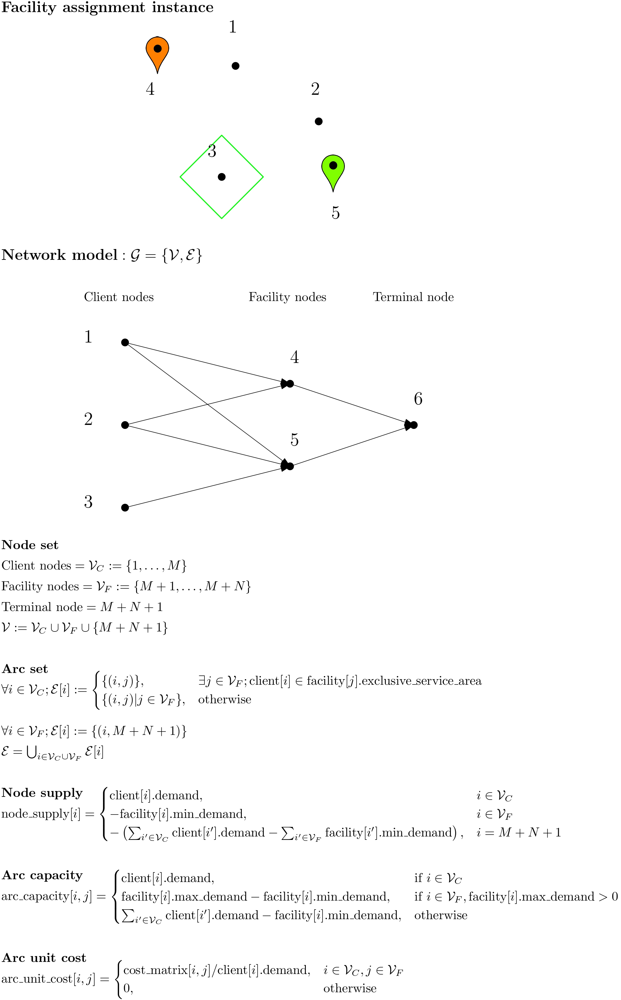
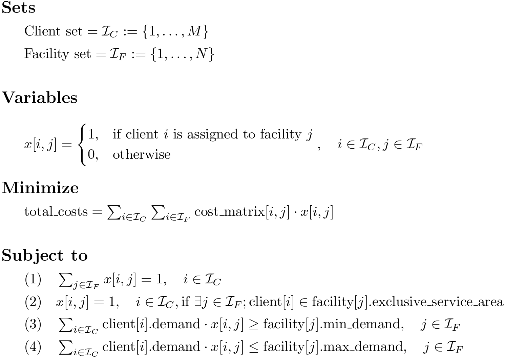

# Online Facility Assignment API


The main objective is to efficiently assign client demands, which arrive in real-time and stochastically, to logistic facilities. This is done by minimizing the total proximity (or total travel distance, or total travel time) between the facilities and the clients, while respecting possible minimum or maximum demand constraints and exclusive service areas of each logistic facility.

The REST API, developed with [FastAPI](https://github.com/tiangolo/fastapi), provides endpoints to solve the problem in two phases:

**Planning Phase:** `POST v1/solve-assignment`

Using historical client demand data, the endpoint solves the problem of assigning clients to logistic facilities, respecting possible demand constraints and exclusive service areas, all while minimizing the objective function. From this assignment, the service areas of each logistic facility are constructed.

The assignment problem was modeled in two ways: as a minimum cost flow problem and using mixed-integer linear programming (MILP). For the minimum cost flow modeling, I used [OR-Tools](https://developers.google.com/optimization/flow/assignment_min_cost_flow) with its solver based on the push-relabel algorithm. For MILP modeling, I turned to [Pyomo](https://www.pyomo.org/) and the [HiGHS](https://github.com/ERGO-Code/HiGHS) solver, known for its high performance. In defining the service areas, I used a concave hull algorithm that I developed and is available for use on PyPI under the name [uhull](https://luanleonardo.github.io/uhull/).

Assignment problem models:

1. **Minimum cost flow**

   

3. **Mixed integer linear programming**

   

**Execution Phase:** `POST v1/client-assignment`

This endpoint assigns new clients to the facilities, respecting their possible demand constraints and the service areas defined in the planning phase.

All the basic theoretical foundation can be found in the reference:

## Reference
> Matheus Suknaic; Fillipe Goulart; Juan Camilo. A Territory-based Approach for the Facility Assignment Problem with a Minimum Cost Formulation. In: ANAIS DO SIMPóSIO BRASILEIRO DE PESQUISA OPERACIONAL, 2022, Juiz de Fora. Anais eletrônicos... Campinas, Galoá, 2022. Disponível em: <https://proceedings.science/sbpo/sbpo-2022/trabalhos/a-territory-based-approach-for-the-facility-assignment-problem-with-a-minimum-co?lang=pt-br> Acesso em: 02 mar. 2024.

## POST v1/solve-assignment
> https://facility-assignment-api.onrender.com/v1/solve-assignment

This endpoint solves the problem of assigning clients to facilities and constructs the service areas of each logistics facility, respecting their possible demand restrictions and exclusive service areas, minimizing the objective function.

The **`algorithm`** for solving the problem of assigning clients to facilities can be:

1. **Minimum cost flow** (`"algorithm": 1`)
2. **Mixed integer linear programming** (`"algorithm": 2`)

By default, the minimum cost flow algorithm will be used as it is a faster algorithm and presents the same solution quality as the MILP algorithm.

Three **`objective`** functions can be selected:

1. **Minimize proximity** (`"objective": 1`): the proximity between facilities and clients will be minimized, proximity will be calculated using the spherical distance between them.
2. **Minimize travel distance** (`"objective": 2`): the street travel distance using a car between logistics facilities and clients will be minimized. The _Open Source Routing Machine (OSRM)_ server will be queried to obtain travel distances between logistics facilities and clients.
3. **Minimize travel duration** (`"objective": 3`): the street travel duration using a car between logistics facilities and clients will be minimized. The _Open Source Routing Machine (OSRM)_ server will be queried to obtain travel durations between logistics facilities and clients.
    

By default the objective will be to minimize proximity. The other objectives are time consuming as they depend on the availability of open resources of the OSRM service.

The request body must have the following format:

``` json
{
   "algorithm":"<1 or 2> [optional]",
   "objective":"<1, 2 or 3> [optional]",
   "totalDemand":"<positive integer representing the total demand to be met>",
   "facilities":[
      {
         "id":"<string for facility id>",
         "name":"<string for facility name>",
         "lat":"<float for location latitude coordinate>",
         "lng":"<float for location longitude coordinate>",
         "minDemand":"<non negative integer for facility minimum demand> [optional]",
         "maxDemand":"<non negative integer for facility maximum demand> [optional]",
         "exclusiveServiceArea":"<Geojson of polygons/multipolygons for facility exclusive service area> [optional]"
      },
      ...
   ],
   "clients":[
      {
         "id":"<string for client id>",
         "lat":"<float for location latitude coordinate>",
         "lng":"<float for location longitude coordinate>",
         "demand":"<positive float for the client demand> [optional]"
      },
      ...
   ]
}

 ```

The response body has the following format:

``` json
{
  "solutionStatus": "<1, 2 or 3>",
  "message": "<message from the solver>",
  "objectiveValue": "<non negative float for the objective value in the returned solution>",
  "assignedFacilities": [
    {
      "facility": "<string for facility id>",
      "assignedClients": [
        "<string for assigned client id>",
        ...
      ],
      "expectedDemand": "<non negative float for the facility expected demand>",
      "serviceArea": "<Geojson of polygons/multipolygons for facility service area>",
      "expectedOptimalTspRouteDistance": "<non-negative float for the optimal distance expected, in kilometers, for the TSP route to meet all facility expected demand>"
    },
    ...
  ]
}

 ```

## POST v1/client-assignment
> https://facility-assignment-api.onrender.com/v1/client-assignment

This endpoint assigns new clients to facilities, respecting their possible demand restrictions and service areas.

[TODO]

## Postman 
* [Documentation](https://documenter.getpostman.com/view/32527568/2sA2rGte4D)

## GitHub
* [Repository](https://github.com/luanleonardo/facility-assignment-api)
